# 🍽️ Flutter Recipe App

A Flutter-based recipe app with Firebase backend.  
Users can browse recipes, view details, and manage favorites.  
Admin panel included for managing users and recipes.

## 🚀 Features
- Firebase Authentication (Login / Signup)
- Role-based Access (Admin & User)
- Recipe Management (Add, Update, Delete)
- Search & Filter Recipes
- Beautiful UI with Material Design

## 🛠️ Tech Stack
- Flutter
- Firebase (Auth, Firestore, Storage)
- Provider (State Management)

## 📂 Project Setup
```bash
git clone https://github.com/parwez28/flutter-recipe-app.git
cd flutter-recipe-app
flutter pub get
```

Add your own google-services.json (Android) and GoogleService-Info.plist (iOS)

Run the project:
```bash
flutter run
```


## 📸 Screenshots

### Users


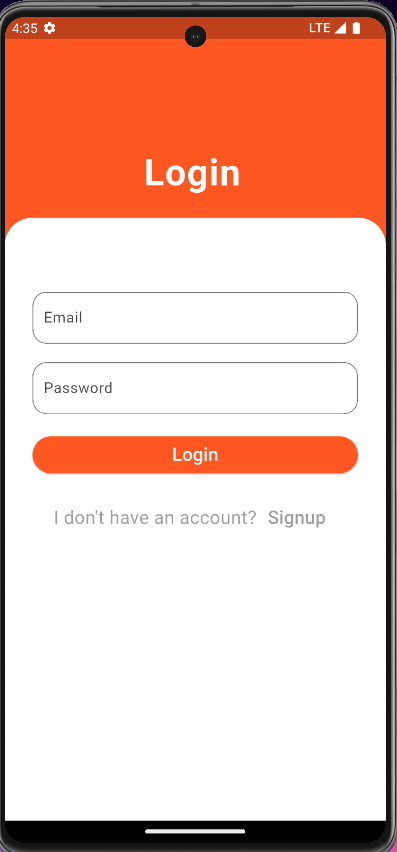
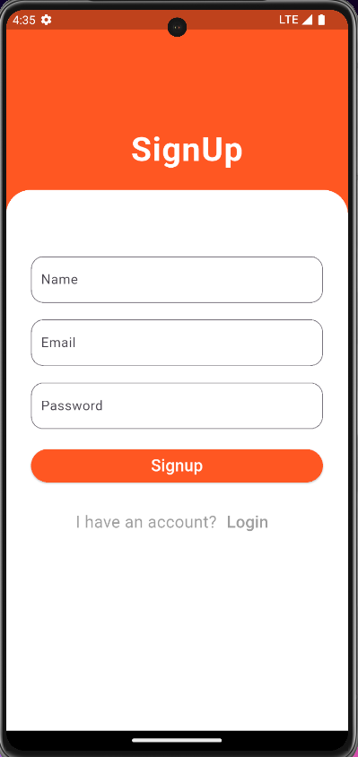
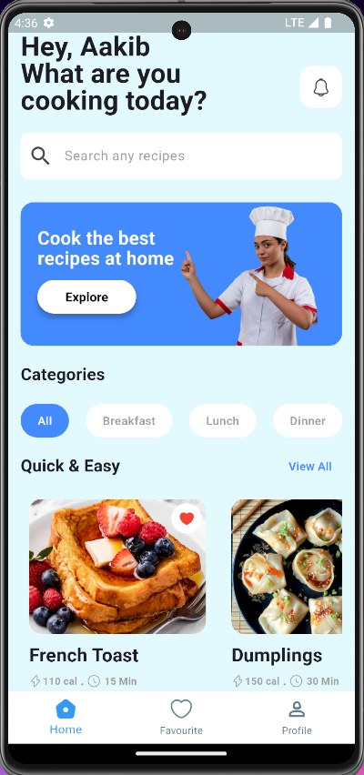
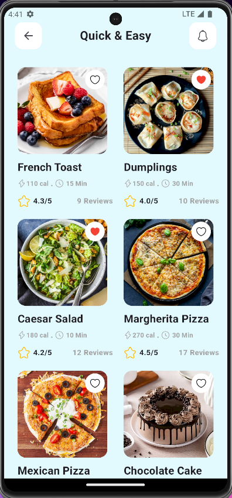
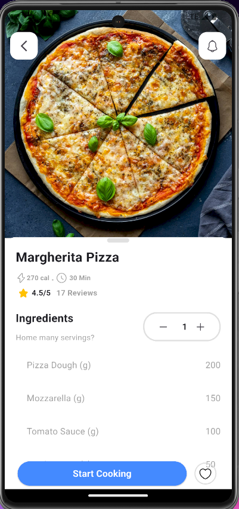
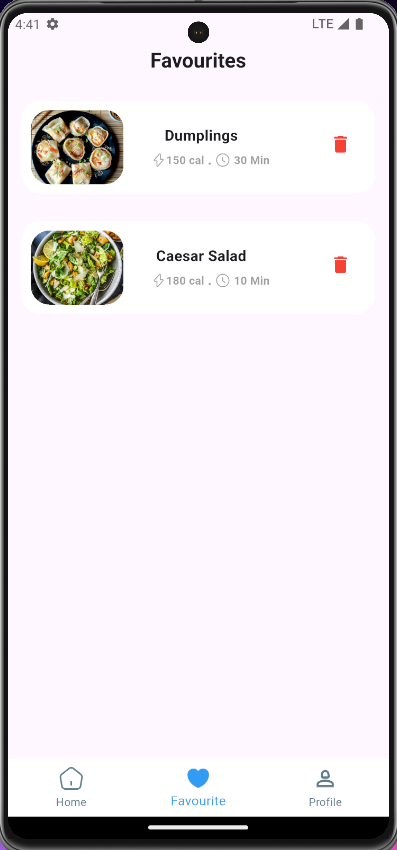
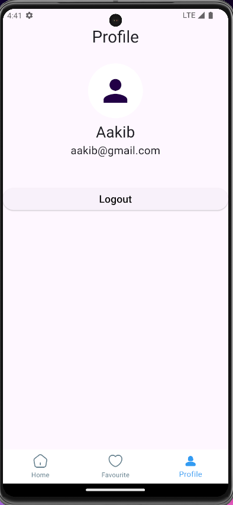

### Admin

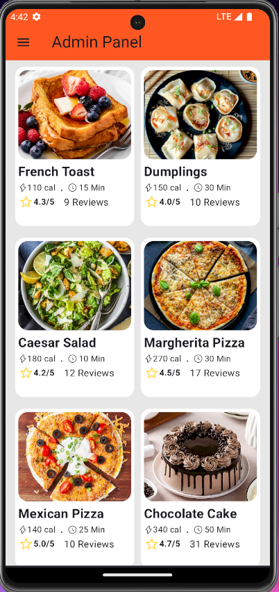
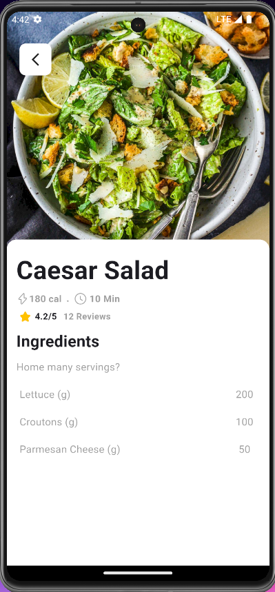
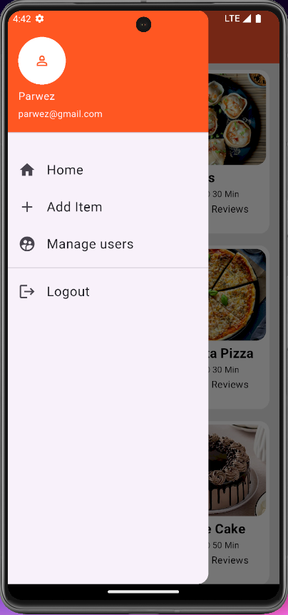
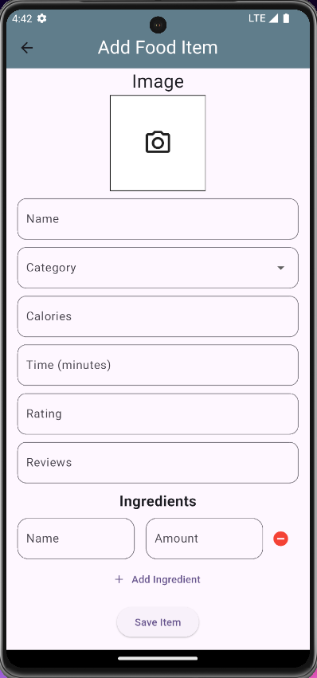


## 📜 License
MIT License © 2025 [Parwez Aalam](https://github.com/parwez28)


